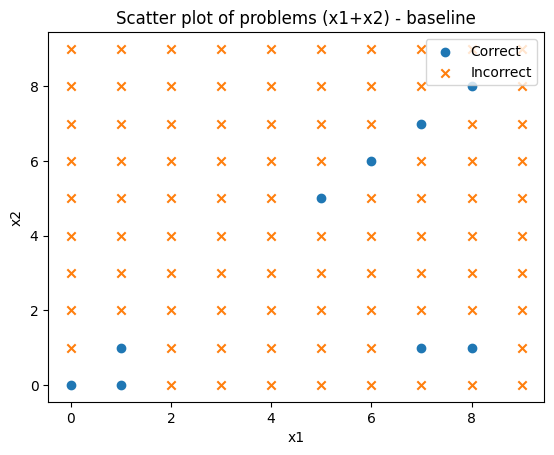
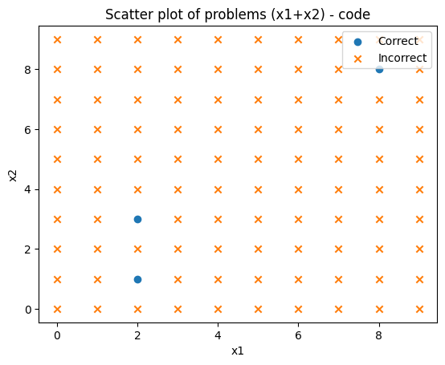
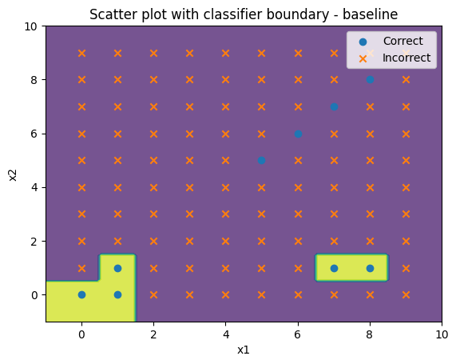
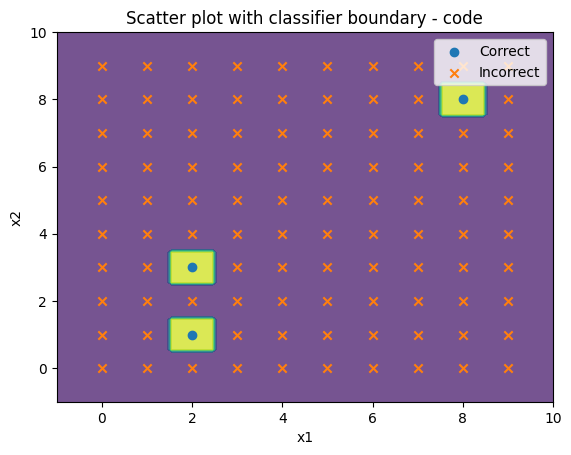

# CS229 HW1 CalcGPt

### Method for encoding strings (1 point)

The function will encode each value pair `xi` with a different encoding strategy depending on the argument strategy. The default strategy is `"baseline"`, which represents the value pair as an additive expression, e.g., `"0+0="`. If the strategy argument is `"code"`, the encoding will be done in a different format, e.g. `"A=0, B=0, A+B="`.
The tokenized input will be like:
`[15, 10, 15, 28]` and `[32, 28, 15, 11, 347, 28, 15, 11, 317, 10, 33, 28]`

### Method for generating text (1 point)

Generates text output for a given set of text fragments prompts using a specified language model model and a splitter tokenizer. The function first sub-phrases and encodes each text fragment, then feeds it into the model to generate text output, and decodes the generated text output into strings.
`pad_token_id=tokenizer.eos_token_id`: set the padding marker during text generation. When generating text using the language model, we need to specify a fixed length input, so if the input is not long enough, we need to add a padding token at the end of the input to fill it to the specified length. The `eos_token_id` is the token ID for the end-of-sentence token.

### Method for decoding strings (1 point)

The function will decode each string in the string list output_strings, the decoding strategy varies depending on the strategy parameter. The default strategy is baseline, which extracts the first number from output string, e.g., `0+0=0+0=0+0=0+0=0+0=`. We need to notice that the input were removed in our `main` function. If the strategy argument is code, the last number is extracted from a string encoded in the format `A=0, B=0, A+B=1, A-B=1,`, etc. The result of the decoding will be returned as a list of values y_hat. If the decoding is wrong, the function will set the value in the corresponding position to NaN.
The tokenized output will be like:
`[15, 10, 15, 28, 15, 10, 15, 28, 15, 10, 15, 28, 15, 10, 15, 28, 15, 10, 15, 28]` and `[32, 28, 15, 11, 347, 28, 15, 11, 317, 10, 33, 28, 16, 11, 317, 12, 33, 28, 16, 11]`

### Results (6 points)

Accuracy for baseline: 9.00%

Time to generate text: 1109.3179371356964

Accuracy for code: 3.00%

Time to generate text: 607.0889291763306

Accuracy on training data: 96.00%

Accuracy on training data: 99.00%

The RandomForestClassifier is a popular choice for classification tasks in machine learning due to several advantages it offers:

- It can handle both binary and multi-class classification problems.
- It can handle both continuous and categorical features.
- It is less prone to overfitting than single decision trees, due to the ensemble method used to combine multiple decision trees.
- It can handle missing values and outliers in the data.
- It can provide a measure of feature importance, allowing us to understand which features are most important in making predictions.

The accuracy of the model for the baseline strategy is reported to be 9%, while for the code strategy it is 3%. These accuracy values indicate that the model is performing poorly on both strategies, and is not able to accurately predict the correct solution to the addition problem.

However, the accuracy on the training data is reported to be much higher, with 96% for the baseline strategy and 99% for the code strategy. This indicates that the model is overfitting to the training data and is not able to generalize well to new, unseen data.

### AI collaboration statement (1 point to include)

I use ChatGPT to help me read my own code, let it recognize what my code does, and use his come back to complete my write-up tasks. Also, I use the ChatGPT to write the function `analyze_results`. Because you give too much information, then it can understand what we ask and only need to do some little change to let it run good result.
